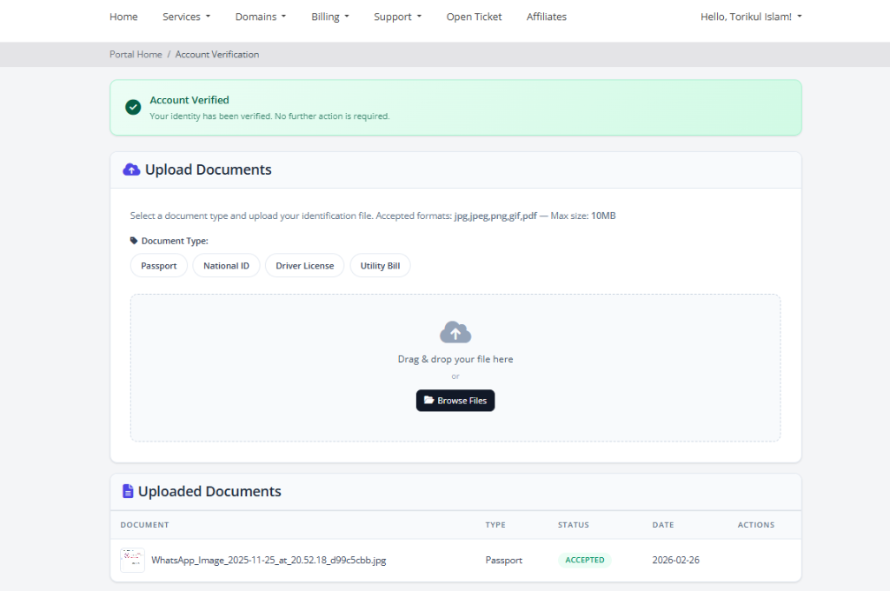
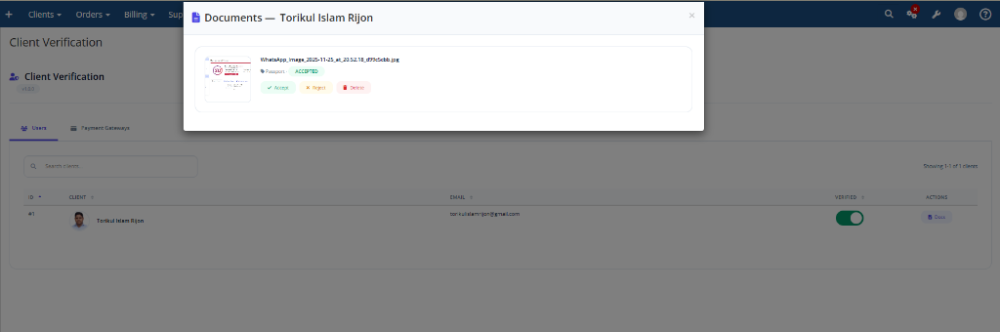

<div align="center">
  <h1>WHMCS Client Verification Module</h1>
  <p>A modern, lightweight WHMCS addon module for robust manual identity verification, document management, and checkout enforcement.</p>
  
  <a href="https://github.com/torikulislamrijon/whmcs-client-verify/stargazers"></a>
  <a href="https://github.com/torikulislamrijon/whmcs-client-verify/network/members"></a>
  <a href="https://github.com/torikulislamrijon/whmcs-client-verify/issues"></a>
  
</div>

<br>

## 🚀 Features

- **Seamless Client Experience**: Drag-and-drop document upload interface directly in the WHMCS Client Area.
- **Admin Review Dashboard**: Sortable, paginated grid of all clients with an interactive document review modal.
- **Approval Workflow**: Admins can easily Accept, Reject, or Delete uploaded documents. Verification status pills update instantly.
- **Gateway Enforcement**: Block checkout for unverified clients on a per-gateway basis (e.g., allow PayPal for anyone, but require verification for Stripe).
- **Secure Handling**: Documents are stored outside the public web root, prefixed by `clientId`, and referenced via SHA-256 hashes.
- **Zero Third-Party Bloat**: Built cleanly using native WHMCS conventions, standard Bootstrap components, and Vanilla JS / jQuery. No bulky third-party libraries.

---

## 📸 Screenshots

*(Add screenshots of your Admin Area Dashboard, Client Upload Interface, and Document Review Modal here)*

### Client Upload Interface


### Admin Document Review Modal


---

## ⚙️ Requirements

- **WHMCS**: 8.x or 9.x
- **PHP**: 8.1 or higher
- **Database**: MySQL 5.7+ / MariaDB 10.2+

---

## 🛠️ Installation

1. **Download the Release**
   Download the latest ZIP release from the [Releases page](../../releases).

2. **Upload to Server**
   Extract the archive and upload the `clientverify` folder into your WHMCS `modules/addons/` directory:
   ```text
   /path/to/whmcs/modules/addons/clientverify
   ```

3. **Activate the Module**
   - Log into your WHMCS Admin Area.
   - Navigate to **Configuration () > System Settings > Addon Modules**.
   - Find **Client Verification** and click **Activate**.

4. **Configure Settings**
   Click **Configure** on the module row and set the following permissions and options:
   - **Access Control:** Select the admin role groups who can access the module dashboard.
   - **Document Types:** Define the names of documents users can upload (e.g., `Passport, Driving License, National ID`).
   - **Storage Path:** Define the absolute path where files will be stored. *We highly recommend setting this OUTSIDE of `public_html` for security (e.g., `/var/whmcs_data/clientverify`).*
   - **Max File Size:** The maximum upload limit per file in MB.
   - **Allowed Extensions:** Define allowed extensions (e.g., `jpg,png,pdf`).

---

## 📖 Usage Guide

### Admin Management
- Go to **Addons > Client Verification** to access the dashboard.
- The **Users** tab allows you to search for clients, manually toggle their verification status, and view their uploaded documents.
- The **Payment Gateways** tab allows you to toggle which gateways **require** the user to be fully verified before they can checkout.

### Client Uploads
- Unverified clients will see a notice during checkout if they try to use a restricted gateway.
- They can navigate to their **Client Area > Account > Account Verification** to securely upload their identification documents.
- Documents are reviewed by your team in the Admin Area.

---

## 📁 File Structure Overview

```text
clientverify/
├── clientverify.php          # Main WHMCS Module Configuration
├── hooks.php                 # Core hooks (Checkout blocking, UI injection)
├── lib/                      # Core PHP Logic
│   ├── AjaxHandler.php           # Secure endpoint routing
│   └── VerificationService.php   # Database queries & Business logic
├── templates/                # Smarty Views
│   ├── admin/dashboard.tpl       # Admin UI
│   └── client/clientarea.tpl     # Client UI
└── assets/                   # CSS and JS
    ├── css/module.css
    ├── js/admin.js
    └── js/client.js
```

---

## 🤝 Contributing

Contributions are completely welcome! If you find a bug or have a feature request, please open an issue or submit a pull request. Make sure your PR adheres to standard PSR-12 coding guidelines and WHMCS module best practices.

---

## 📄 License

This project is licensed under a **Custom Proprietary License**. It is provided for personal and internal business use only. You are NOT permitted to sell or redistribute this software for commercial purposes. See the [LICENSE](LICENSE) file for complete details.
